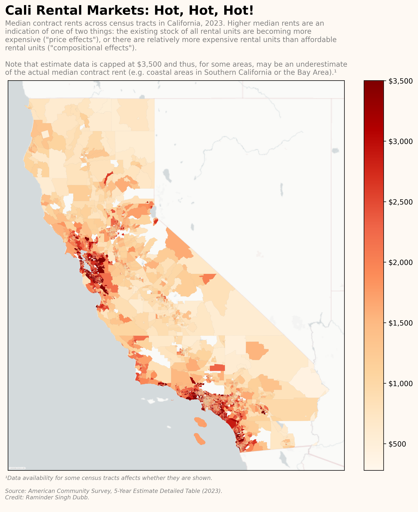

# [acspsuedo](https://github.com/ramindersinghdubb/acspsuedo/)

[](#licensing) [](https://github.com/ramindersinghdubb/acspsuedo/issues) [](https://ramindersinghdubb.github.io/acspsuedo)

Objects for handling the extraction of American Community Survey data.

**As of May 2026, the Census Bureau requires API keys for any and all interactions with the Census Bureau's API.** Sign up for a free API key at [https://api.census.gov/data/key_signup.html](https://api.census.gov/data/key_signup.html).

## Installation

From source:

```bash
$ git clone https://github.com/ramindersinghdubb/acspsuedo
$ cd acspsuedo
$ pip install .
```

## Purposes

`acspsuedo` seeks to make data queries and extraction as seemless as possible with a user-friendly interface designed to support a host of purposes, such as:
- Running data queries to the Bureau, with support for concurrent application for users interested in ETL/ELT processes

- Querying metadata on particular variable and/or table information offered by any one of the ACS datasets (cf. `acspsuedo.datasets`)

- Querying metadata on the types of geographic scopes at which ACS demographic data may be available at (such as at the state-level, the county-level, and so forth)

- Enabling users with Census Bureau API keys to run multiple data queries in a session

- Continuous monitoring of the Census Bureau API, in order to ensure the most up-to-date information on all ACS datasets

- Caching the Bureau's Topologically Integerated Geographic Encoding and Referencing (TIGER) shapefiles, which are designed to provide geographic representations to support maps and/or geographic analysis

## Usage

See [notebooks](https://github.com/ramindersinghdubb/acspsuedo/tree/main/notebooks/) for a demonstration of the module's utilities/interface.

<br>

`acspsuedo` handles the extraction of ACS data. For example, if one were interested in the [B25058 "Median Contract Rents" table from the American Community Survey's 5-Year Estimates Detailed Tables dataset at the census tract level for California](https://api.census.gov/data/2023/acs/acs5?get=group(B25058)&for=tract:*&in=state:06), it would be as so.

```python
import acspsuedo.query as apq
from acspsuedo.datasets import ACS5
from acspsuedo.fips.states import CA

df = apq.download(
    dataset = ACS5,
    year    = 2023,
    table   = 'B25058',
    # Geographic specifiers
    state = CA,
    tract = '*'
)
```

Likewise, `acspsuedo` enriches data queries by providing geospatial information taken from the Census Bureau's TIGER Shapefile database. As a result, users can conduct geospatial analysis/visualization.

```python
gdf = apq.download(
    dataset = ACS5,
    year    = 2023,
    table   = 'B25058',
    include_geometries = True,
    # Geographic specifiers
    state = CA,
    tract = '*'
)
```

An example of some geospatial visualization with the data generated from the query above. You can click on the image to see the notebook that generated it.

[](./notebooks/Querying_Data_ACS5_2023.ipynb)

~~Note that an API key is recommended for querying multiple (50+) datasets in a session. You can obtain a free API key at [https://api.census.gov/data/key_signup.html](https://api.census.gov/data/key_signup.html). We have implemented a interface via `acspsuedo.query.api_key_config` in which users can set their API keys. See the [`notebooks/API_Key`](https://github.com/ramindersinghdubb/acspsuedo/blob/main/notebooks/API_Key.ipynb) notebook.~~

**As of May 2026, the Census Bureau requires API keys for any and all interactions with the Census Bureau's API.** Sign up for a free API key at [https://api.census.gov/data/key_signup.html](https://api.census.gov/data/key_signup.html).

## Repo Structure

```
acspsuedo/
├── .github/
│   └── workflows/
│       ├── ...
│       └── run-scripts.yml      # CI/CD to ensure upkeep with API releases
│
├── acspsuedo/
│   ├── fips/                    # Federal Information Processing Standard (FIPS) Codes
│   │   └── ...
│   │
│   ├── source/
│   │   └── ...
│   │
│   ├── __init__.py
│   ├── datasets.py              # Info on supported datasets
│   └── query.py                 # Main interface
│
├── notebooks/
│   └── ...
│
├── tests/
│   └── ...
│
├── utils/
│   └── ...
│
├── .gitattributes
├── .gitignore
├── LICENSE
├── poetry.lock
├── pyproject.toml
└── README.md
```

## Coverage Report

[https://ramindersinghdubb.github.io/acspsuedo/](https://ramindersinghdubb.github.io/acspsuedo/)

## Licensing

`acspsuedo` is licensed under the terms and conditions of the `MIT` license.
