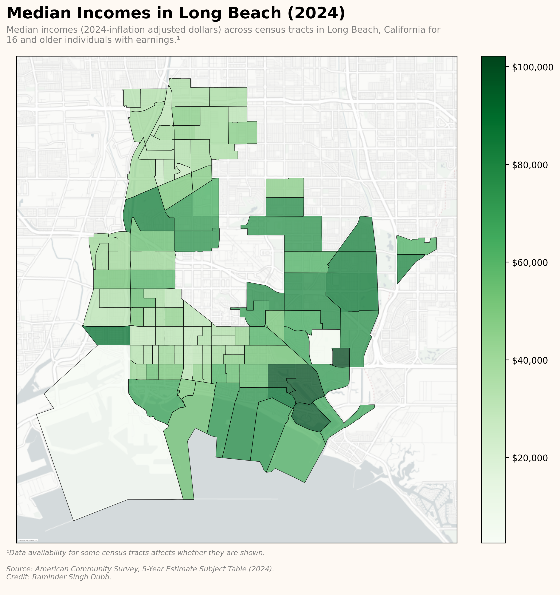

# Notebook Descriptions

These notebooks are provided as user demonstration for navigating the module's utilities.

| Notebook    | Description | Link |
| ----------- | ----------- | ---- |
| `Querying_Data_ACS5_2023.ipynb` | How to query data, with an example from the American Community Survey 5-Year Detailed Table. | [Link](https://github.com/ramindersinghdubb/acspsuedo/blob/main/notebooks/Querying_Data_ACS5_2023.ipynb) |
| `Confined_Downloads.ipynb` | How to confine data queries at a given set of inner-level geographies to a different outer-layer geographic scope than otherwise permissible, with an example from the American Community Survey 5-Year Subject Table. | [Link](https://github.com/ramindersinghdubb/acspsuedo/blob/main/notebooks/Confined_Downloads.ipynb) |
| `API_Key.ipynb` | How to set up an API key, in case of occasions where users may run multiple (500+) queries to Census Bureau data in a daily session. | [Link](https://github.com/ramindersinghdubb/acspsuedo/blob/main/notebooks/API_Key.ipynb) |
| `TIGER_Shapefiles.ipynb` | A brief primer on the shapefile handler interface used to format queried data with geometric information extracted from the Census Bureau's Topologically Integerated Geographic Encoding and Referencing (TIGER) shapefiles. | [Link](https://github.com/ramindersinghdubb/acspsuedo/blob/main/notebooks/TIGER_Shapefiles.ipynb) |
| `Viewing_Geo_Metadata_ACS1_2021.ipynb` | Viewing geographic specifiers that are compatible for the specified combination of dataset and year, with an example from the American Community Survey 1-Year Detailed Table. | [Link](https://github.com/ramindersinghdubb/acspsuedo/blob/main/notebooks/Viewing_Geo_Metadata_ACS1_2021.ipynb) |
| `Viewing_Metadata_ACS1_PUMS_2014.ipynb` | Viewing metadata for a dataset, with an example from the American Community Survey 1-Year Public Use Microdata Sample. | [Link](https://github.com/ramindersinghdubb/acspsuedo/blob/main/notebooks/Viewing_Metadata_ACS1_PUMS_2014.ipynb) |

## Examples

Click on an image to see the respective notebook that generated it.

 